

    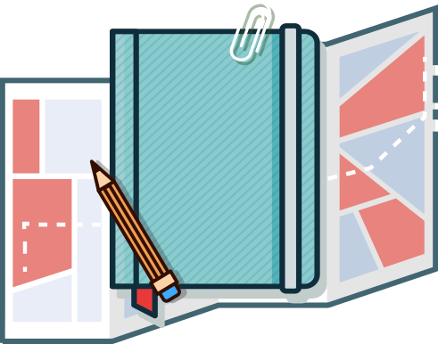

<h1 align="center">
	Travel Journal
</h1>

    <b>
    🧭📝🌎
     
    #Travel #Journal #Itinerary #Android #MobileApp #SocialApp
    </b>

> Mobile application dedicated to people, who want to travel in an organized way, to be able to entirely enjoy the previously planned journeys, possessing all necessary data in one place. In one sentence it's an advanced equivalent of a travel journal with social functions.

*Application was made as a part of my Engineer's Thesis.*

## Table of contents
* [Introduction](#introduction)
* [Presentation](#presentation)
* [Assumptions](#assumptions)
* [Requirements](#requirements)
* [Tools&Technologies](#tools&technologies)
* [Database](#database)
* [Features](#features)
* [Screenshots](#screenshots)
* [Setup](#setup)

## Introduction
**Travel Journal** is an android mobile application that is literally...a travel journal. :frog: _What a surprise!_
 
It's hard to describe the application in one word, so i'll try in more of them. So, let's start at the beginning. _Ekhem..._
  
**Travel Journal** is travel and social application for those, **who would like to plan it from the beginning** in a **organized** way and later **document** it in this way too. It's for those, who would like to feel like a **journalist**, **traveler of own journey**. :notebook:
 
Starting from the beginning of our journey, the first step is to create a **traveler account**. It's possible either with an e-mail address and password, or by a Google account. We choose a catchy nickname and we can start our **adventure**! :rocket:
 
It is also recommended to **complete your profile** with additional information so that others can also get to know you. Profile icon, short description, set location, preferences in form of tags like **#camping, #beach, #exploration, #landscape, #mountains**... all this can show **what kind of person** you are and what kind of traveling is **"yours"**. :smiley: :two_hearts:
 
Every user has the opportunity to create a **dream list** of **places to visit**. This is possible by setting **pins** on a special **map**. These can be small trips in the form of a dream cafe, but also large travels to **unexplored** places, beyond our reach at the moment and those remaining in the sphere of dreams. By **adding pins** with an added description and a properly selected color, **you will never forget about them**! :star:
 
Do you already have an initial **travel plan**? Yes? So **let's start planning!** Add fundamental informations like destination, date of departure and return with hours, recognizable name, and also tags with pictorial photo, which identify your **journey**! It's good to add transport and accommodation details like types, possible contact details and also files f.e. tickets. **It's really helpful to have it all in one place.** In the application it is also possible to manage the budget for the trip, so don't forget to fill it too. Have not planned detailed informations yet? No problem, complete or edit them later. **No rush, just still be organized.** :raised_hands:
 
**The travel is planned**, it's time to **start packing**. Create a packing list divided into specific categories. Check off items that you have already packed. Use those offered by the application and **you will not forget anything**. :bikini: :handbag:
 
...And that's what the first day of the trip was about. You have tickets **at hand** that you can download at any time. You have all the information entered and you have finished the packing list. **The journey has begun!** Document your trip by: writing notes, adding journal entries, adding photos and visited places. Evaluate each of the days - was it boring / interesting / funny / cheerful / sad? **Document all days from your trip to the end  and create memories by journal entries.** :memo:
  
**Use functions that will be useful on every trip.**
* :world_map: **The map** will allow you to orientate yourself in the field, it will show your location as well as places in the vicinity of the type you are looking for. 
* :money_with_wings: **The currency converter** will allow you to check the current exchange rate.
* :speech_balloon: **The translator** will help you abroad.
* :sunrise: **The alarm** will send you a notification at the given time with a note made by you. You will never be late for a trip / plane / sunrise / whatever - again!
* :sunny: The sky is overcast? Or maybe you are planning something until tomorrow? Check **the weather forecast** and be forewarned. 

**The journey is over** - summarize it and write conclusions at note with what you saw, how it was and whether you liked it, what is worth to see, who do you recommend it to and what someone should be careful about. Finally, **the collected data will be used to create document**, which could be an **album with memories - a travel journal**. All notes, journal entries, photos, visited and rated places and days - everything will be written to one simple **PDF document**, which you can download at any time.  :open_book: :eyes:
 
What is also important that it's possible to **share this document with other users** as **an itinerary for their own trips**! This will contribute to the creation of a **community that shares itineraries with others and uses these already shared**. Everyone (or only your friends) can use it to plan their own travels by reading your notes, visiting places you recommend. You also can be **inspired by the trips created by other users**. This can be of great help in planning future adventures! :bomb: :boom: 
 
You can **browse such travel plans** created and shared by the community, **search for specific ones** by filling in the appropriate filters, as well as **sort by the newest, closest, most popular**. You can **save the ones that catch your eye** for quick access later or **download travel plan to your smartphone.** :relieved: :iphone:
 
As mentioned before, you can also **add other users to your friends list**. you can **find them** by searching their name or by **discovering people** who share their travel plans. You **send an invitation** to such people and you can accept / reject such an invitation. You can also **contact with people** if they shared their email address. By creating such small groups of friends, we can **track their trips** and **check their travel status**. In addition, they can only share their plan with friends that we will then have access to! :astonished: :revolving_hearts:
  
_The main assumption of the application is to enable the consumer to conveniently and easily coordinate, document and plan travel with quick access to the necessary functions and data, which would help to enjoy the trip in a pleasant and clear way. All this was to combine social functions with the possibility of exchanging travel plans with others, communicating and creating small communities._

## Presentation
The presentation was placed on Google Drive and contains descriptions of functionalities with many GIFs straight from the application. [Check it out](https://drive.google.com/file/d/1lUZCNzaE11b7k1tHZqj14VzPzHPK9DiP/view?usp=sharing) :smile:

## Assumptions
#### Objectives:
 * :star2: **Development of an mobile application** for a user, who wants to travel in an organized way, to have all the content and needed informations in one place, f.e.: about planned trip, attractions, interesting places, photos and notes, weather forecast, etc.
  * :star2: **Design and creation template of a document** based on travel's data that can be used by others as an itinerary for own trips
  * :star2: **Creation of a community** that shares itineraries with others

#### Range:
 * :star: **Analysis of functionalities** needed by the user for organized traveling
 * :star: **Analysis of technologies and tools** which are necessary in the project
 * :star: **Analysis of data** that will be shared
 * :star: **Design a database** for stored data
 * :star: **Design a template** for sharing travel documents with other users
 * :star: **Develop an application**

## Requirements
* **System:** Android 4.4 or newer
* **Tool:** Android Emulator or Android device (highly recommended)
* **Language:** English
* **Modules and permissions:**
    * Internet connection 
    * For some functionalities GPS module with granted permissions to detect location
    * Granted permissions with read and write from/to memory to upload and download files
    * Granted permission to receive notifications for the alarm function.
    * To use Google services, the Google Play Services application must be installed 

## Tools&Technologies
* Java 1.8
* Android Studio 3.6.3
* Gradle 3.6.3
* Firebase Platform
    * Firebase Authentication
    * Cloud Firestore
    * Cloud Storage
* Google Maps Platform
    * Maps SDK for Android
    * Places API
* Android Architecture Components
    * View Binding
    * LiveData
    * Data Binding Library
* Material Design
* Model-view-ViewModel (MVVM)
* [OpenWeatherMap](https://openweathermap.org/current) | [CC BY-SA 4.0](https://creativecommons.org/licenses/by-sa/4.0/) & [ODbL](https://opendatacommons.org/licenses/odbl/)
    * Current weather data
    * 5 day / 3 hour forecast
* [Exchange rates API](https://github.com/exchangeratesapi/exchangeratesapi) | MIT
* [Yandex.Translate](https://tech.yandex.com/translate/doc/dg/concepts/about-docpage) | Yandex Search Engine [CC BY-SA 4.0](https://creativecommons.org/licenses/by-sa/4.0/)
* [Bubble Navigation](https://github.com/gauravk95/bubble-navigation) | ver. 1.0.7 | Apache 2.0
* [CircularImageView](https://github.com/lopspower/CircularImageView) | ver. 4.1.1 | Apache 2.0
* [HashtagView](https://github.com/greenfrvr/hashtag-view) | ver. 1.3.1 | MIT
* [Nachos](https://github.com/hootsuite/nachos) | ver. 1.1.1 | Apache 2.0
* [Material Spinner](https://github.com/jaredrummler/MaterialSpinner) | ver. 1.3.1 | Apache 2.0
* [Compressor](https://github.com/zetbaitsu/Compressor) | ver. 2.1.0 | Apache 2.0
* [Android Image Cropper](https://github.com/ArthurHub/Android-Image-Cropper) | ver. 2.8.0 | Apache 2.0
* [Glide](https://github.com/bumptech/glide) | ver. 4.11.0 | [License](https://github.com/bumptech/glide/blob/master/LICENSE)
* [LoopingViewPager](https://github.com/siralam/LoopingViewPager) | ver. 1.2.0 | MIT
* [ColorPicker](https://github.com/kristiyanP/colorpicker) | ver. 1.1.10 | Apache 2.0
* [BoomMenu](https://github.com/Nightonke/BoomMenu) | ver. 2.1.1 | Apache 2.0
* [Retrofit](https://square.github.io/retrofit) | ver. 2.5.0 | Apache 2.0
* [Gson](https://github.com/google/gson) | ver. 2.8.6 | Apache 2.0

## Features
##### :last_quarter_moon_with_face: Creating an account, logging in, registration
* Creating an account, hereinafter referred as an Traveler's account or profile:
    * By e-mail address and password, additionally specifying the username
    * By Google account
* After registering with an e-mail address and password, account verification is required. The message with a link for verification will be sent to the provided e-mail
* If you forget your password, you can send a message to an e-mail address with a link to set a new one
* Logging into a previously created account
* Save login details by SmartLock service. 

##### :last_quarter_moon_with_face: Traveler profile
* Basic profile information preview:
    * profile icon
    * username
    * short description - bio
    * location
    * preferences - considering privacy settings of data visibility
* Possibility to send e-mail messages - only in case of allowed access to the someone's e-mail address
* Access to the list of incoming notifications such as:
    * friendship invitation - the ability to accept and add someone to the friends list or decline the invitation
    * preview of friend's travel status
* Possibility to send an invitation to the friends list - only in the case of a profile other than yours and no connection to a given profile (users are not friends)
* Access to the list of friends with the option of visiting selected profile or removing a person from the list (only in case of own profile)
* Access to the list of user's own trips and those saved with the possibility of previewing the trip or deleting a given entity (only in case of own profile)
* Access to the settings (only in case of own profile)
* Logging out (only in case of own profile) 

##### :last_quarter_moon_with_face: Settings
* Account, Traveler profile settings with the possibility of changing:
    * profile icons
    * short description - bio
    * location
    * preferences list - tags
    * username
    * e-mail address
    * password
    * privacy settings (visibility of: e-mail address, location, preferences - public, only for friends or private)
* Access to information about the author and version of the application
* List of libraries and solutions used with appropriate licenses and links
* Access to contact with technical support. 

##### :last_quarter_moon_with_face: Trip preview
* Overview of basic information about the trip:
    * name
    * illustrative photo
    * destination
    * date of departure and return
    * owner (with a link to the profile)
    * tags
* Possibility to download the travel plan document (if visible)
* Possibility to save a trip - only if it's not a logged in user trip. 

##### :last_quarter_moon_with_face: Board, current trip, handy tools
* Quick access to functions:
    * Map and nearby places
    * Weather forecasts
    * Translator
    * Currency converter
    * Alarm with notifications
* In the absence of an active trip - the possibility of creating a new one
* For an existing active trip:
    * Access to the packing list with the possibility of:
        * adding a new item to a selected category
        * adding a new category
        * marking already packed items
        * deleting items with categories
        * finishing packing
    * Ability to preview, add, edit and delete:
        * notes, entries
        * photos with description
        * visited places with description and rating
    * The ability to manage the budget and add new expenses by category
    * Possibility to discover nearby places
    * Access to basic travel informations:
        * name
        * illustrative photo
        * destination
        * date of departure and return
        * transport and accommodation
            * type
            * possible contact details
            * the option to download files, e.g. booking)
            * tags
    * Possibility to edit information of travel:
        * name
        * photo
        * tags
    * Ability to evaluate the day of the trip
    * Ability to end the trip - complete the description, set the sharing options and create a travel plan document. 

##### :last_quarter_moon_with_face: Creation of a new journey
* Adding basic information: name, pictorial photo, date of departure and return with hours, destination, transport and accommodation (type, possible contact details and files, e.g. booking), budget and tags
    * name
    * illustrative photo
    * destination
    * date of departure and return with hours
    * transport and accommodation
        * type
        * possible contact details
    * budget
    * tags
* Ability to set an alarm with a reminder for the date and time of departure.

##### :last_quarter_moon_with_face: Home page
* Ability to discover travel plans shared by others
* Possibility to search for travel plans:
    * by keywords with the possibility of filtering by:
        * duration
        * destination
        * tags
* Possibility to sort the results by:
    * popularity
    * date of creation
    * duration of trips)
* Access to the map with the possibility of:
    * discovering
    * searching and adding dream places to visit along with short notes in order to plan future trips - pins are placed on the map, which can be read (place name, address and a possible note) and deleted
* Ability to search for friends by username. 

## Database

**The database consists of collections storing:**
* Addresses - locations of places
* Days - days of ongoing travel
* Itineraries - finished travel plans with ending document
* Markers - pins to set on the map with dream places to visit
* Notifications - about friend's travel status or invitation to friends list
* Reservations - transports and accommodations of travel
* Travels
* Users

Each collection has a set of documents with a given identifier. It is in the document that the data of a specific object are contained. The illustration below shows the database and the developed structure of one of the Addresses collection documents.

	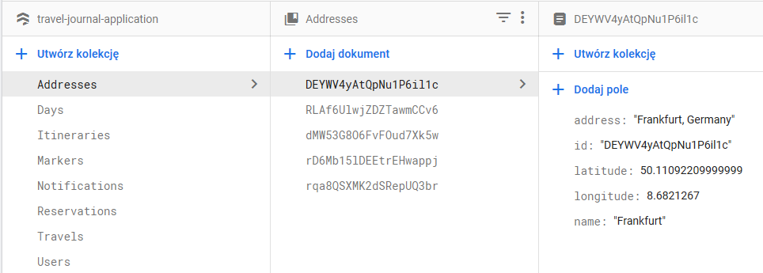

The rest of the collections is shown in the image below.

	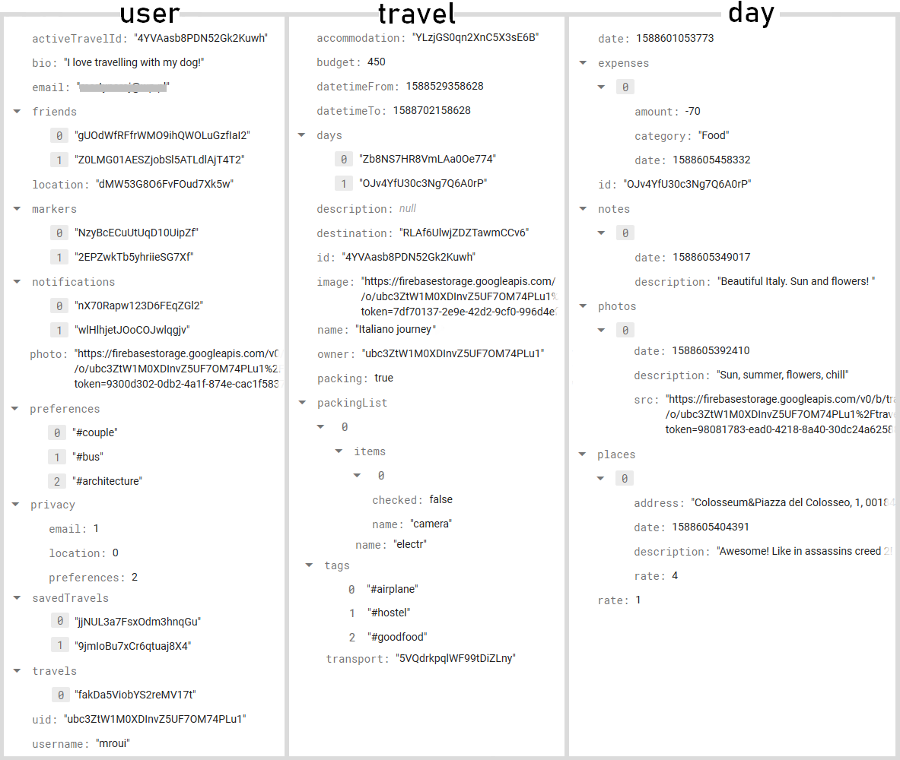
	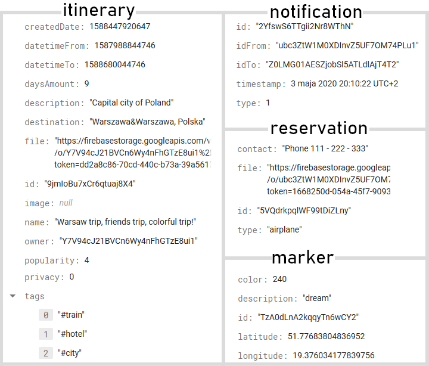

## Screenshots
[Move on quickly to setup](#setup)

	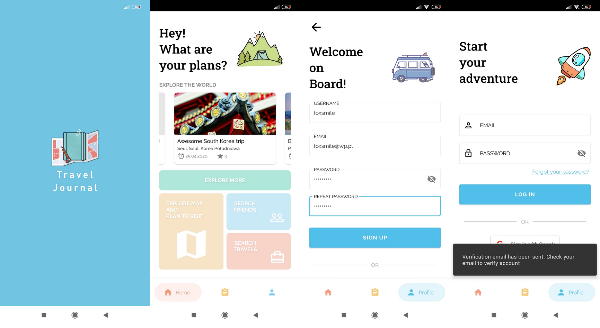
	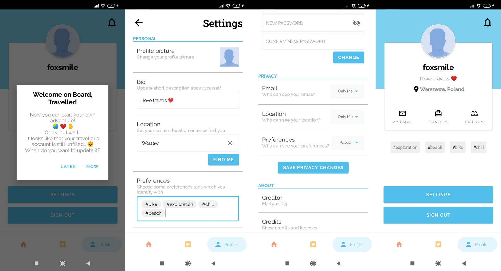
	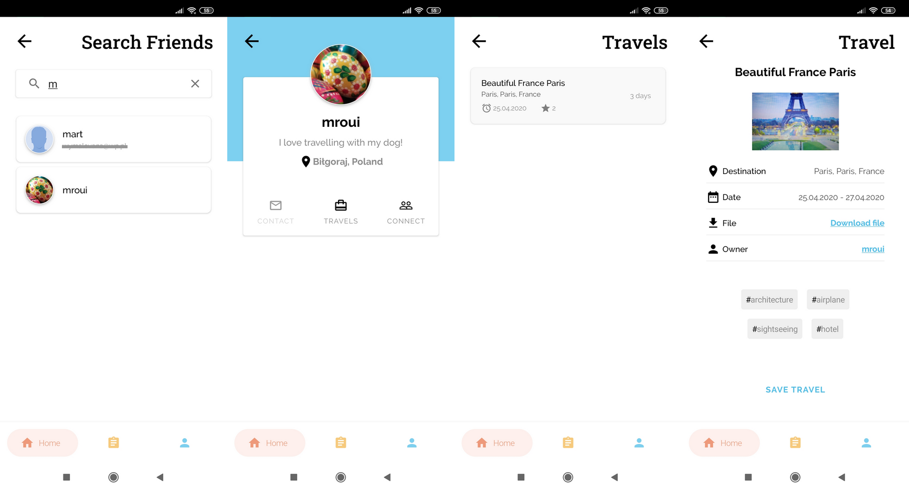
	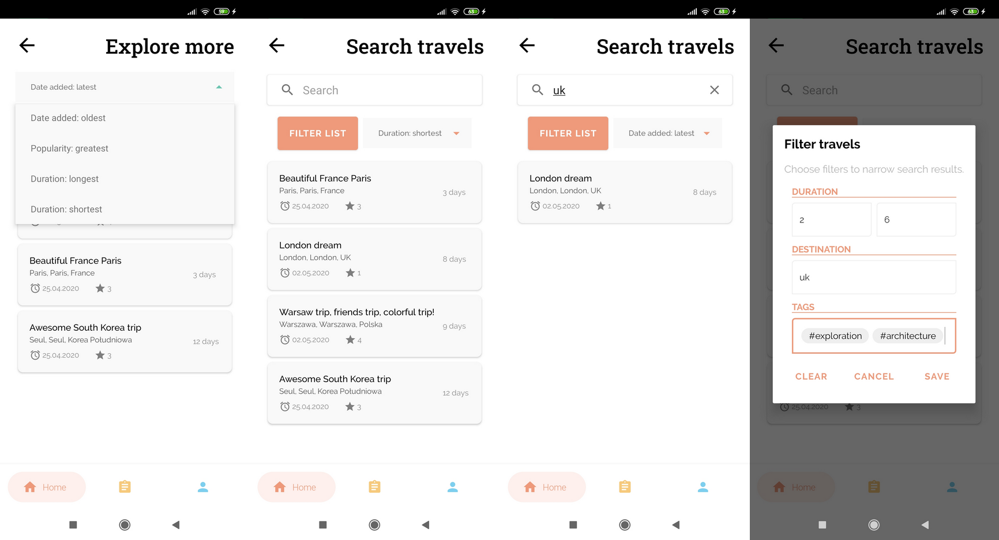
	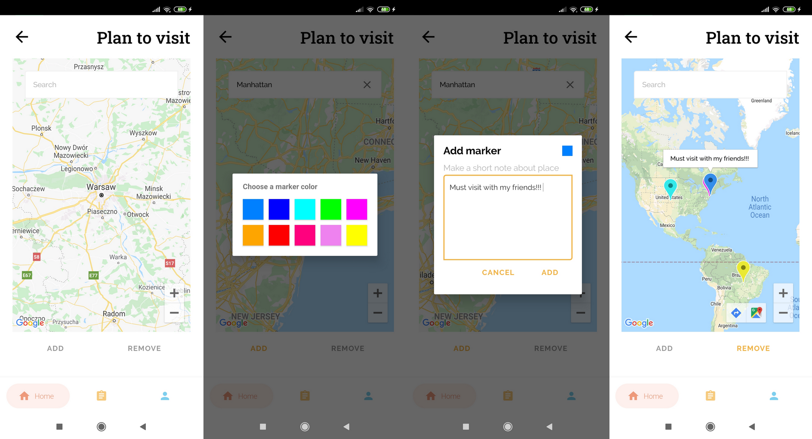
	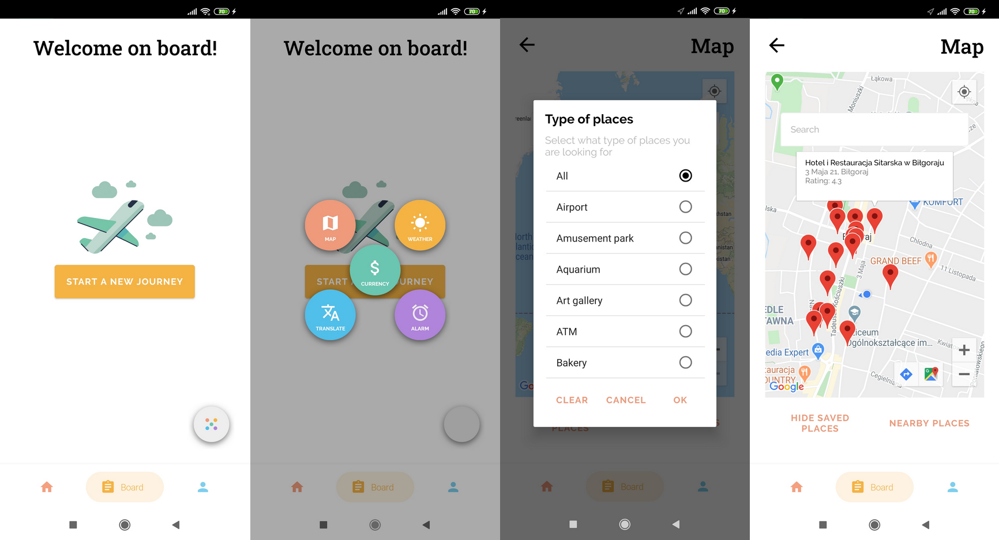
	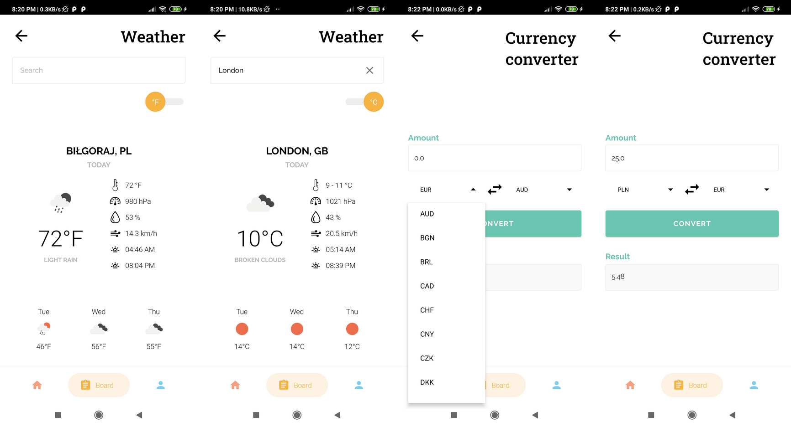
	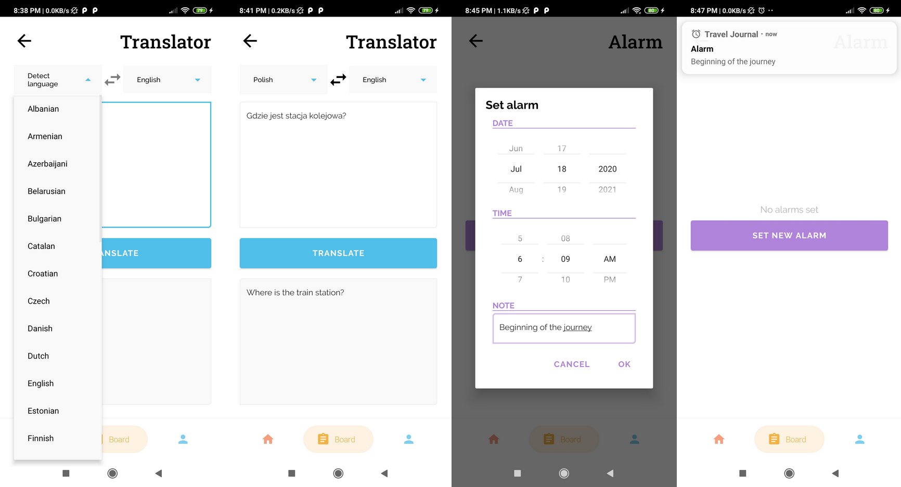
	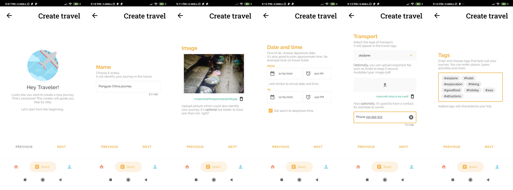
	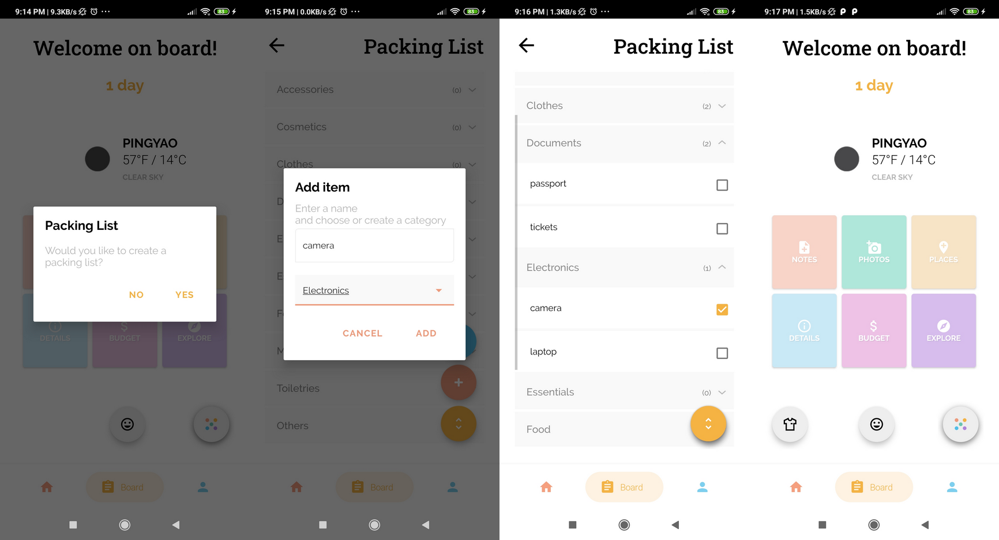
	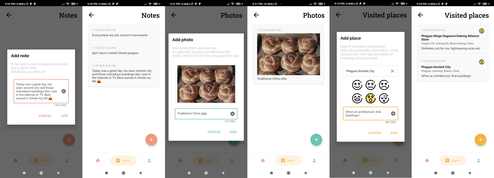
	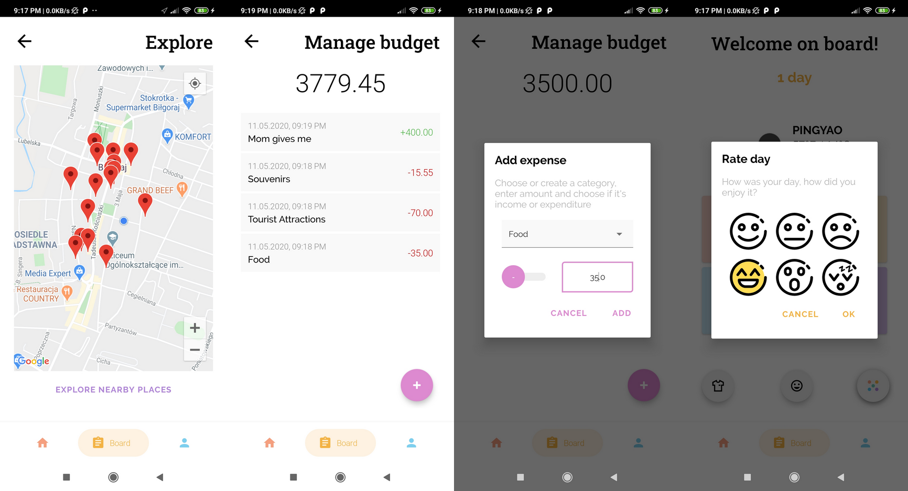
	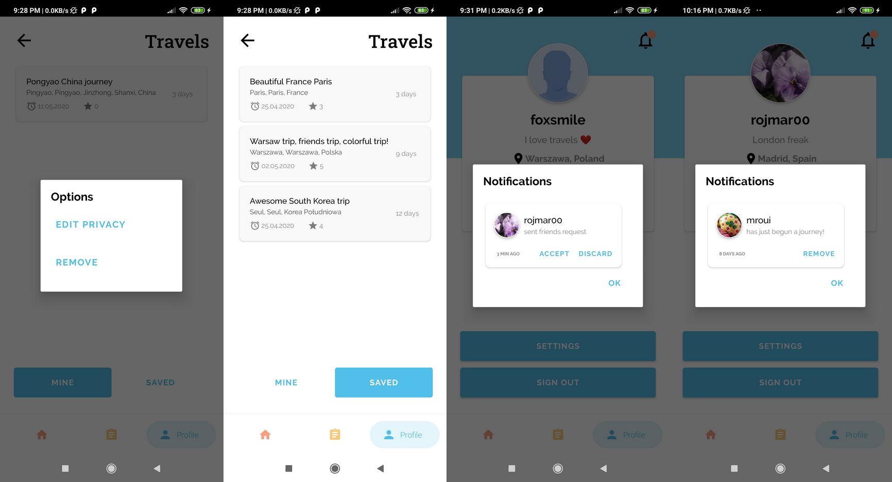
	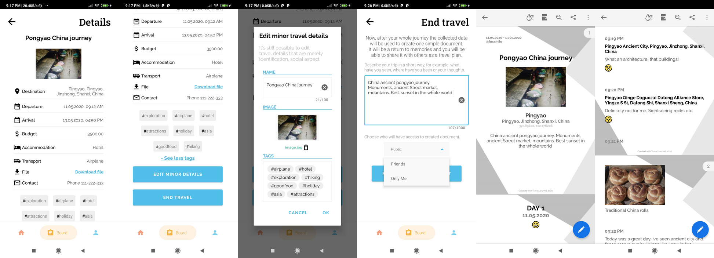

## Setup